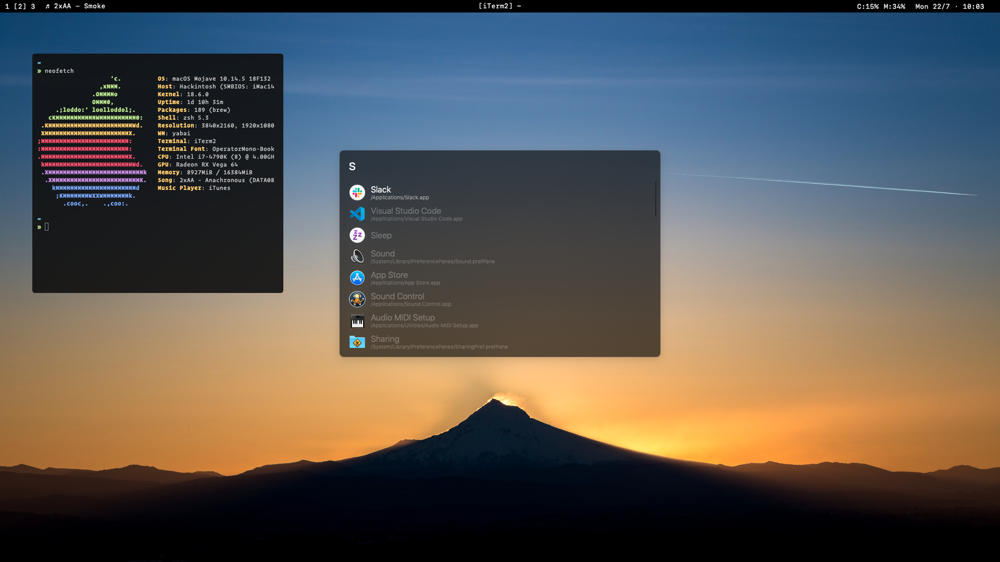

# Lumière

_Lumiere_ is:

- A collection of [Übersicht](https://github.com/felixhageloh/uebersicht) widgets made to emulate a custom menubar for macOS
- An [Alfred](https://www.alfredapp.com/) theme

# Disclaimer

The widgets are still a WIP, things may break, look weird or even max out your CPU, proceed at your own risks!

# Screenshot

# TODO

- [ ] Write documentation
- [ ] Support other players than iTunes?