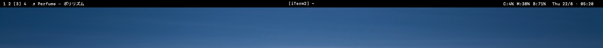
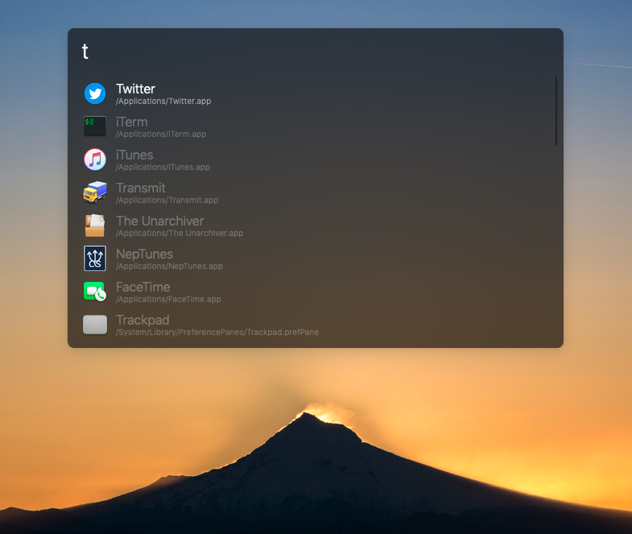

# Lumière

_Lumiere_ is:

- A collection of [Übersicht](https://github.com/felixhageloh/uebersicht) widgets made to emulate a custom menubar for macOS
- An [Alfred](https://www.alfredapp.com/) theme

> (French) Lumière -> (English) Light


## Übersicht Widgets

All the widgets work together to make one menubar with (what I think is) the bare minimum.



[View all widgets](widgets.md)

### Requirements
- [Übersicht](http://tracesof.net/uebersicht)
- [yabai](http://tracesof.net/uebersicht) for the spaces/window title widgets.

### Installation

#### CLI

```
$ git clone https://github.com/eramdam/lumiere
$ cp -r lumiere/widgets ~/Library/Application\ Support/Übersicht/widgets/lumiere
```

#### Manual

- Download the [latest version of the repo](https://github.com/eramdam/lumiere/releases/latest)
- Unzip it
- Move the `widgets` folder into your `Übersicht/widgets` directory

**Disclaimer:** if your battery is draining like crazy, feel free to adjust the `refreshFrequency` of some of the widgets or remove the widgets files entirely to disable those you don't need.


## Alfred theme



### Requirements
- [Alfred](https://alfredapp.com)

### Installation

#### CLI
```
$ git clone https://github.com/eramdam/lumiere
$ open alfred/Lumiere.alfredappearance
```

#### Manual

- Download the [latest version of the repo](https://github.com/eramdam/lumiere/releases/latest)
- Unzip it
- Open the `alfred` folder and double-click on `Lumiere.alfredappearance`

# Inspirations
- [nero](https://github.com/lucaorio/nero) by [Luca Orio](https://github.com/lucaorio)
- [pecan](https://github.com/zzzeyez/pecan) by [Daniel Neemann](https://github.com/zzzeyez)

