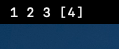
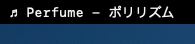
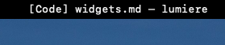
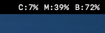
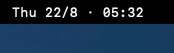

# Lumière Widgets

## Space

Shows the number of yabai/Mission Control spaces with the current one between brackets

## Current track

Show the artist and name of the currently played track from iTunes or Spotify.
Automatically hides when nothing is playing.

## Window title

Show the curently focused app (between brackets) and the focused window's title.

Note that since it uses yabai, any window ignored/not detected by it won't be reported it.

## System stats

Shows the CPU usage, Memory usage, and remaining battery as a percentage

## Date & time

Shows the current date and time. Tweak `lumiere-clock.jsx` to adjust the command and get a 24h format instead of a 12h one

